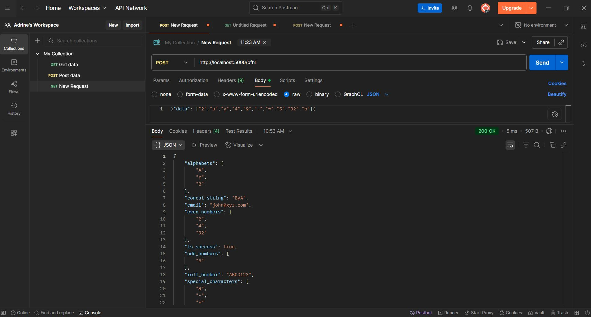
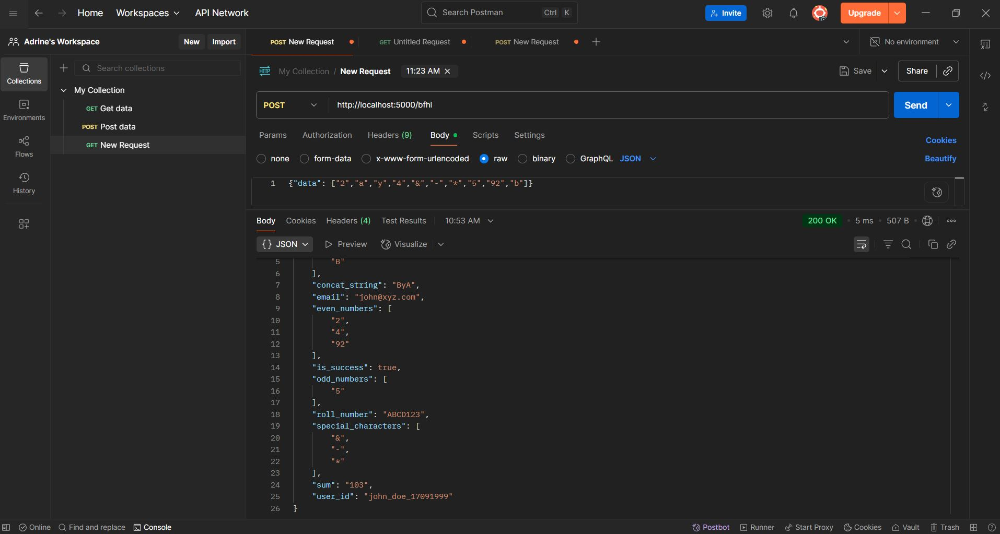

# BajajFinservFullStackADRINE22BCE0757
# Build and host a REST API (Method: POST) that takes in an array and returns the output in given format (Done using Python)

This project is a REST API built with Flask to handle a POST request at the `/bfhl` route.

### 1. Entire Output Working in Postman

- The API is fully functional and tested using **Postman**.
- Correct output is being returned in the required format.

Screenshot of Postman output is included in the repository and attached below.

## Postman Correct Output


---

### 2. Heroku CLI Installation Issue

- I tried downloading and installing **Heroku CLI**, but it was not connecting or recognizing commands.
- Due to this, the deployment to Heroku could not be completed.
---

### Project Files

- `app.py`: Main Flask app
- `requirements.txt`: Python dependencies
- `README.md`: This file

---

### How to Run Locally

```bash
pip install -r requirements.txt
python app.py
